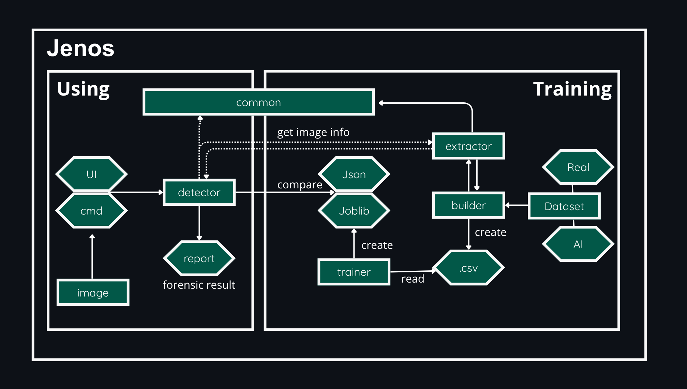

# jenos-heuristic-image-analyzer


Digital forensics tool that estimates the probability that an image (`.jpg`, `.png`) was **generated or manipulated by AI**, using classic heuristic forensic-analysis methods (instead of a "black-box" neural network). The result always comes with the features that weighed most heavily in the decision.

## Table of contents

1. [How it works](#1-how-it-works)
2. [Code structure](#2-code-structure)
3. [Installation](#3-installation)
4. [Dataset structure](#4-dataset-structure)
5. [Usage](#5-usage)
6. [Known limitations](#6-known-limitations)

---

## 1. How it works

Each image goes through **27 heuristic analyses**: ELA, noise/PRNU analysis, FFT, entropy, wavelet, CFA, chromatic noise, saturation/LAB, and edge density. These values feed a supervised classifier (RandomForest), pre-trained on real and AI-generated images, returning the estimated probability that the image was AI-generated/manipulated and the features that weighed most heavily in that decision (evidence report).

## 2. Code structure



The project separates two fronts that don't mix:

| Front | Files | Who uses it |
|---|---|---|
| Dataset build/training | `builder.py`, `trainer.py` | Only whoever develops/validates the model, generating the artifacts (`.json`, `.joblib`) |
| Usage | `detector.py` | Final product, only loads the ready artifacts and doesn't train anything |

**`common.py`** ensures every image, in both training and usage, goes through the same standardization (resize to 1024×1024 and safe isolation of the ELA temporary file), preventing the file's resolution from becoming a decision shortcut instead of authenticity.

**`trainer.py`** trains a binary classifier (RandomForest by default, `--model logistic` as an alternative) from already-labeled real and AI images, reporting accuracy, precision, recall, F1, AUC-ROC, and confusion matrix.

## 3. Installation

```bash
git clone https://github.com/xeixera/jenos-heuristic-image-analyzer.git
pip install -r requirements.txt
```

## 4. Dataset structure

```
dataset/
    real/
        faces/
        <custom>/
    ia/
        faces/
        <custom>/
```

Each subfolder of `dataset/real/` defines a class, automatically detected by `builder.py`.

> **Warning:** for train with your dataset make sure there's native resolution variation within each class, overlapping between `real` and `ia`. If one class comes entirely from a single resolution and the other from a different one, the model may learn to distinguish file origin instead of authenticity (be suspicious of perfect accuracy/AUC).

## 5. Usage

**Step 1 — Build the dataset** (all classes at once):
```bash
python3 builder.py
```
Generates `output/baseline_<class>.json` and `output/features_<class>.csv`.

**Step 2 — Train** (one class at a time):
```bash
python3 trainer.py --class faces
```

Optional: `--model {random-forest, logistic}`, `--holdout 0.25`.

Generates `output/model_<class>.joblib` and `output/metrics_<class>.json`.

**Step 3 — Analyze**:
```bash
# single image
python3 detector.py --class faces --image path/image.jpg

# batch (CSV)
python3 detector.py --class faces --dir dataset/test/faces --output output/results.csv
```

## 6. Known limitations

- **ELA on PNG**: the signal is still computed, but its forensic meaning is weaker (the technique assumes double JPEG compression). The `_metadataOriginalFormatJpeg` metadata field lets you segment this analysis later.
- **AI generator diversity**: training with a single generator tends to teach the model to recognize that specific generator, not "AI in general".
- **Manual class selection**: today `--class` is entered by hand; an automatic scene classifier is a natural future extension. (Being implemented)
- **UI**: planned as a desktop app (for use by other examiners), where the terminal keeps working independently. (Being implemented)